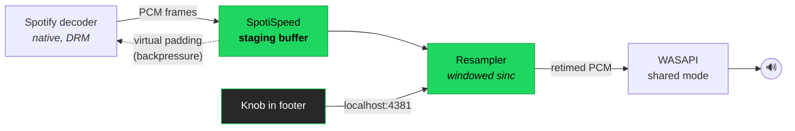
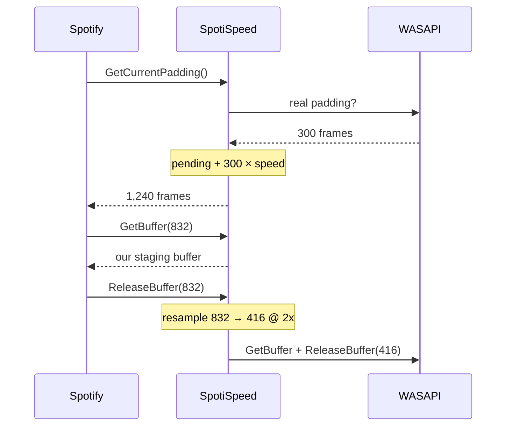

<div align="center">

# SpotiSpeed

### A playback speed knob for the Spotify desktop app.

Drag it. Your music slows down or speeds up — pitch and all, like a record player.


</div>

---

```
 ┌──────────────────────────────────────────────────────────────────────┐
 │  ⏮   ▶   ⏭   🔁            ◠ 0.75x                                   │
 │  ─────────────────────────────────────────────────────  1:12 / 3:44  │
 └──────────────────────────────────────────────────────────────────────┘
                              ▲
                    the knob lives here
```

**Drag up/down** to change speed · **Click** to snap back to 1x · **Scroll** for fine steps

---

## Why this exists

Spotify has a speed control. It only works on podcasts.

Ask the desktop app to change the speed of a *song* and the player says no, in
those exact words:

```
setSpeed(2)  →  Command failed with code '1' and reasons 'not_supported_by_content_type'
```

That refusal comes from Spotify's native audio engine, not from the UI, so no
amount of JavaScript gets around it. SpotiSpeed doesn't try. It sits one layer
lower — between Spotify and your sound card — and retimes the audio on its way
out.

---

## Install

1. Download **`SpotiSpeed-Setup.bat`** from [Releases](../../releases/latest)
2. Double click it
3. Watch it work, press Enter when it's done

That's it. One file, no dependencies to hunt down — it installs Spicetify for
you if you don't have it, and starts Spotify when it's finished.

<details>
<summary><b>What the installer touches</b></summary>

| What | Where |
|---|---|
| Audio engine + injector | `%LOCALAPPDATA%\SpotiSpeed\` |
| The knob (Spicetify extension) | `%APPDATA%\spicetify\Extensions\spotispeed.js` |
| Startup entry | Scheduled task `SpotiSpeed` (logon) |
| Update blocker | `%LOCALAPPDATA%\Spotify\Update` |

Nothing leaves your PC. There's no network code in this project except a
localhost socket the knob uses to talk to the engine.

</details>

**To remove it:** run `SpotiSpeed-Remove.bat`. Spotify goes back to stock.

---

## Controls

| Action | What it does |
|---|---|
| **Drag up / down** | Change speed, `0.2x` → `2.0x` |
| **Click** | Reset to `1x` |
| **Scroll wheel** | Fine steps |
| **Shift + drag/scroll** | Very fine steps |
| **Arrow keys** | Same, when focused |

At exactly `1x` the engine is a mathematical no-op — the audio is bit-for-bit
identical to stock Spotify. It only does real work when you move the knob.

---

## How it works

Spotify decodes music natively, inside `Spotify.dll`. The audio never reaches
the web layer, so the usual browser trick (`audio.playbackRate`) has nothing to
grab. What it *does* do is hand finished PCM frames to Windows through WASAPI.

So that's where SpotiSpeed lives.



### The part that makes it actually work

Resampling alone isn't enough. If you only stretch the audio, playing at `2x`
means you need twice as much sound per second — and Spotify is producing it at
exactly 1x real time. You'd run dry in seconds.

The trick is **backpressure**. WASAPI apps ask "how full is the buffer?" before
every write, and write only what fits. SpotiSpeed answers that question itself,
in *source* frames instead of device frames:

```
reported_padding = frames_still_in_my_buffer + real_device_padding × speed
```

At `2x` the answer is roughly twice as large, so Spotify sees twice as much room
and decodes twice as fast to fill it. At `0.2x` it sees almost no room and
throttles down. Spotify's own decoder does the work of matching the rate — we
just move the goalposts.



### Quality

Rate conversion is a 32-tap windowed sinc (Kaiser, β = 8.6, ~90 dB stopband)
with unity-gain normalisation and a cutoff that tracks the ratio, so speeding up
decimates without aliasing. At `1x` with an integer read cursor the kernel
collapses to `sinc(0) = 1` and every other tap lands on a zero crossing — the
output is the input, exactly.

**Measured**, by counting frames on both sides of the resampler:

| Knob | Measured rate | Source frames in | Device frames out |
|:--:|:--:|--:|--:|
| `1.0x` | **1.000** | 265,482 | 265,482 |
| `0.5x` | **0.500** | 132,741 | 265,482 |
| `2.0x` | **2.000** | 530,964 | 265,482 |
| `0.2x` | **0.200** | 53,008 | 265,041 |

---

## How I worked it out

I didn't start here. This is the order things fell over in.

**1. The web trick doesn't apply.** On `open.spotify.com`, music plays through a
real `<video>` element and `playbackRate` just works. So I hooked
`document.createElement` in the desktop app and played a song. Zero media
elements captured. The Shaka player bundled in `xpui.spa` is only for video —
music is decoded natively.

**2. Spotify's own API refuses.** The desktop player does expose a speed method
(`setSpeed`, renamed from `setPlaybackSpeed` somewhere along the way). Calling
it on a track returns `not_supported_by_content_type`, and measured playback
stayed at exactly 1.000.

**3. It's not an entitlement.** The account's product state had
`speed-control = "0"`, and Spotify ships music-specific strings like
`speed-controls.slowed-down-label`, which looked promising. I flipped the flag to
`"1"` and confirmed it stuck. Same refusal. The gate is in native code, keyed on
content type.

**4. It's not a feature flag either.** 1,204 remote-config properties in that
build. Zero matching `speed`, `tempo`, `pitch`, or `slow`.

At that point the web layer was exhausted, so: hook WASAPI in-process and do it
below Spotify entirely.

**5. The bug that cost the most time.** First working hook produced silence, then
a mysterious `0xE06D7363` — a C++ exception, thrown from inside
`AudioSes.dll`'s `GetBuffer`. Turns out the Windows audio engine calls the
client's *virtual* `GetCurrentPadding` from inside `GetBuffer`. That landed back
in my own hook, which tried to take a lock it was already holding, and MSVC
throws on that. Fix is a thread-local re-entrancy guard: while SpotiSpeed is
driving the device, every hook steps aside and calls the original.

**6. The other one.** Advertising a 2x buffer via `GetBufferSize` while still
reporting *real* padding made Spotify ask the device for more frames than it
could hold — instant fatal error. Buffer size and padding are one contract; you
can't fake half of it.

---

## Building it yourself

Needs Visual Studio 2022 with the C++ desktop workload.

```bat
build.bat                                   :: -> bin\spotispeed.dll, bin\ssinject.exe
powershell -File make-installer.ps1         :: -> SpotiSpeed-Setup.bat
```

| File | What it is |
|---|---|
| `src/spotispeed.cpp` | The WASAPI hook and control socket |
| `src/resampler.h` | Windowed-sinc variable-rate resampler |
| `src/inject.cpp` | Loads the DLL into Spotify's main process |
| `ext/spotispeed.js` | The knob |
| `guardian.ps1` | Keeps it all alive across restarts |

---

## Notes

**Spotify can't update anymore.** That's on purpose — an update would replace the
UI bundle and wipe the knob. The installer parks a read-only file where Spotify
stages downloads, so the updater has nowhere to unpack. `SpotiSpeed-Remove.bat`
undoes it.

**The position counter drifts.** Spotify's own clock doesn't know the audio is
being retimed, so the time display won't match at speeds other than 1x. The
audio itself is correct.

**Built and tested against Spotify 1.2.98.300 on Windows 11, x64.** The hook
targets standard shared-mode WASAPI rather than anything Spotify-specific, so it
should survive minor version bumps — but the knob depends on Spicetify
supporting your build.

**Antivirus may complain.** It injects a DLL into another process, which looks
exactly like something you'd want your AV to flag. Source is all here; build it
yourself if you'd rather not trust a binary.

---

## License

MIT — do what you like with it.
