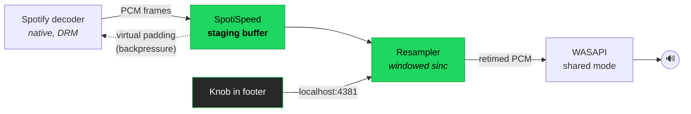
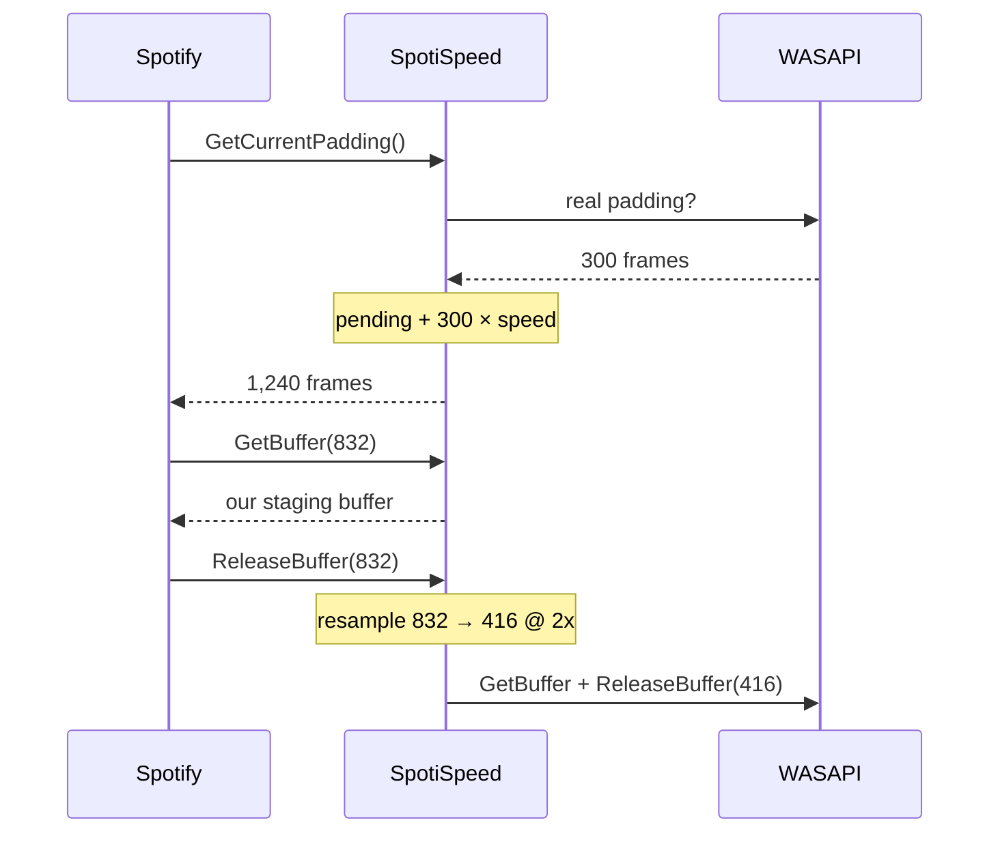

<div align="center">

# SpotiSpeed

### A speed knob for the Spotify desktop app.

Drag it and your music slows down or speeds up. Pitch goes with it, like a record player.


</div>

---

```
 ┌──────────────────────────────────────────────────────────────────────┐
 │  ⏮   ▶   ⏭   🔁            ◠ 0.75x                                   │
 │  ─────────────────────────────────────────────────────  1:12 / 3:44  │
 └──────────────────────────────────────────────────────────────────────┘
                              ▲
                    the knob lives here
```

**Drag up/down** to change speed. **Click** to go back to 1x. **Scroll** for small steps.

---

## Why

Spotify already has a speed control. It only works on podcasts.

If you ask the desktop app to change the speed of an actual song, the player
just says no:

```
setSpeed(2)  ->  Command failed with code '1' and reasons 'not_supported_by_content_type'
```

That refusal comes from Spotify's native audio code, not from the UI, so there's
nothing you can patch in JavaScript to get around it. SpotiSpeed doesn't try. It
sits underneath Spotify instead, between the app and your sound card, and
retimes the audio on the way out.

---

## Install

1. Grab **`SpotiSpeed-Setup.bat`** from [Releases](../../releases/latest)
2. Double click it
3. Press Enter when it's finished

One file, and that's all you need. If you don't have Spicetify it installs that
too, then launches Spotify for you.

<details>
<summary><b>What it puts on your machine</b></summary>

| What | Where |
|---|---|
| Audio engine and injector | `%LOCALAPPDATA%\SpotiSpeed\` |
| The knob (a Spicetify extension) | `%APPDATA%\spicetify\Extensions\spotispeed.js` |
| Startup entry | `Startup\SpotiSpeed.vbs` |
| Update blocker | `%LOCALAPPDATA%\Spotify\Update` |

Nothing gets uploaded anywhere. The only network code in the project is a
localhost socket so the knob can talk to the engine.

</details>

To get rid of it, run `SpotiSpeed-Remove.bat` and Spotify goes back to normal.

---

## Controls

| Action | Result |
|---|---|
| Drag up / down | Change speed, `0.2x` to `2.0x` |
| Click | Reset to `1x` |
| Scroll wheel | Small steps |
| Shift + drag or scroll | Very small steps |
| Arrow keys | Same thing, when focused |

Sitting at `1x` costs you nothing. The maths works out to an exact copy, so the
audio is identical to stock Spotify until you actually move the knob.

---

## How it works

Spotify decodes music natively inside `Spotify.dll`. The audio never shows up in
the web layer at all, so the usual browser trick of setting `playbackRate` on a
media element has nothing to attach to. What Spotify does do is hand finished
PCM frames to Windows through WASAPI, and that part is reachable.



### The bit that actually makes it work

Resampling on its own isn't enough. Playing at `2x` means you need twice as much
audio per second, and Spotify is only producing it at normal speed. You'd run
out almost immediately.

The way around that is backpressure. Before every write, a WASAPI app asks how
much room is left in the buffer, and only writes what fits. SpotiSpeed answers
that question itself, counting in source frames rather than device frames:

```
reported_padding = frames_still_in_my_buffer + real_device_padding * speed
```

At `2x` that number comes out roughly twice as big, so Spotify thinks it has
twice as much room and decodes faster to fill it. At `0.2x` it looks nearly full,
so Spotify slows down. Spotify's own decoder ends up doing the work of matching
the rate. We just move the goalposts.



### Quality

Rate conversion is a 32 tap windowed sinc (Kaiser, β = 8.6, around 90 dB
stopband) with unity gain normalisation. The cutoff follows the ratio so
speeding up decimates without aliasing.

At `1x` with an integer read cursor the kernel collapses to `sinc(0) = 1` and
every other tap lands on a zero crossing, so the output is just the input again.

Here's what it measures, counting frames on both sides of the resampler:

| Knob | Measured rate | Source frames in | Device frames out |
|:--:|:--:|--:|--:|
| `1.0x` | **1.000** | 265,482 | 265,482 |
| `0.5x` | **0.500** | 132,741 | 265,482 |
| `2.0x` | **2.000** | 530,964 | 265,482 |
| `0.2x` | **0.200** | 53,008 | 265,041 |

---

## How I got there

I didn't plan this approach. It's just what was left after everything else fell
over, roughly in this order.

**The web trick doesn't apply here.** On `open.spotify.com` music plays through a
real `<video>` element, so `playbackRate` works fine. I hooked
`document.createElement` in the desktop app to catch the equivalent, played a
song, and caught nothing at all. The Shaka player sitting in `xpui.spa` only
handles video. Music is decoded natively.

**Spotify's own API says no.** There is a speed method on the desktop player
(`setSpeed`, previously `setPlaybackSpeed`). Call it on a track and you get
`not_supported_by_content_type` back, and playback stays at exactly 1.000.

**It isn't an account thing.** The product state had `speed-control` set to `"0"`,
and Spotify ships music specific strings like
`speed-controls.slowed-down-label`, which looked like a lead. I flipped the flag
to `"1"` and checked it stuck. Same refusal. The check is in native code and
keyed on content type.

**It isn't a feature flag either.** That build has 1,204 remote config
properties. None of them match `speed`, `tempo`, `pitch` or `slow`.

So the web layer was a dead end, and the only thing left was to go below Spotify
and hook WASAPI in process.

**The bug that ate the most time.** My first working hook produced silence, then
started throwing `0xE06D7363`, which is a C++ exception coming out of
`AudioSes.dll` inside `GetBuffer`. The Windows audio engine calls the client's
virtual `GetCurrentPadding` from in there, which lands straight back in my own
hook, which then tries to take a lock it's already holding. MSVC throws on that.
Fixed with a thread local re-entrancy guard, so while SpotiSpeed is driving the
device every hook gets out of the way and calls the original.

**And one more.** I advertised a doubled buffer through `GetBufferSize` but was
still returning the real padding. Spotify did the subtraction, asked the device
for more frames than it could hold, and died on the spot. Buffer size and
padding are one contract. You can't fake half of it.

---

## Building it

You need Visual Studio 2022 with the C++ desktop workload.

```bat
build.bat                                   :: -> bin\spotispeed.dll, bin\ssinject.exe
powershell -File make-installer.ps1         :: -> SpotiSpeed-Setup.bat
```

| File | What it is |
|---|---|
| `src/spotispeed.cpp` | The WASAPI hook and the control socket |
| `src/resampler.h` | Windowed sinc variable rate resampler |
| `src/inject.cpp` | Gets the DLL into Spotify's main process |
| `ext/spotispeed.js` | The knob |
| `guardian.ps1` | Keeps everything alive across restarts |

---

## Things worth knowing

**Spotify can't update anymore.** This is intentional. An update swaps out the UI
bundle and the knob disappears with it, so the installer parks a read only file
where Spotify stages its downloads and the updater has nowhere to go.
`SpotiSpeed-Remove.bat` puts it back.

**The time counter drifts.** Spotify's clock has no idea the audio is being
retimed, so at anything other than 1x the position display won't line up. The
audio is still correct.

**Tested on Spotify 1.2.98.300, Windows 11, x64.** The hook targets ordinary
shared mode WASAPI rather than anything specific to Spotify, so small version
bumps should be fine. The knob is the fragile part, since it needs Spicetify to
support your build.

**Antivirus might not like it.** It injects a DLL into another process, which is
exactly the behaviour AV is built to catch. All the source is here if you'd
rather compile it yourself than trust a binary.

---

## License

MIT. Do whatever you want with it.
